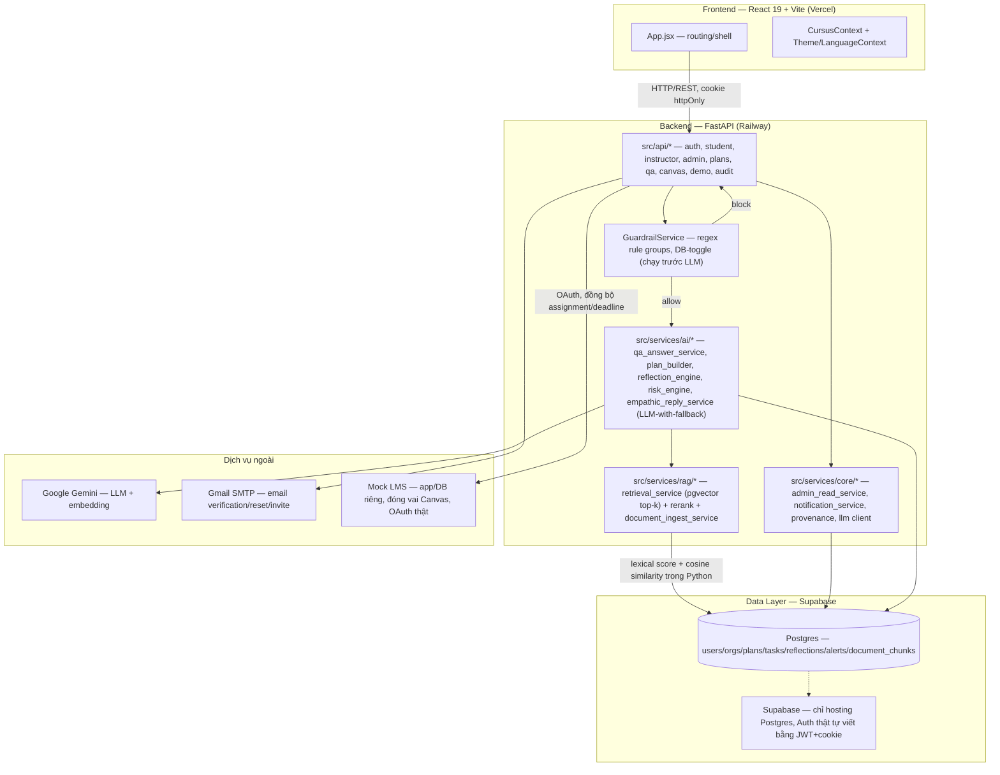
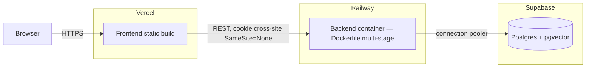

# Architecture Document

> **Cập nhật 22/08/2026** — đối chiếu lại toàn văn với code thật sau 1 đêm build P0 (Mock LMS, trace wiring, LLM08 content validation, audit log org-scoping). Phần lớn nội dung 15/08 vẫn đúng, chỉ sửa các chỗ đã lệch — xem từng mục có đánh dấu `[Cập nhật 22/08]`.

## System Overview

Cursus là một web app 3 vai trò (Sinh viên/Giảng viên/Admin) theo chu trình Plan → Do → Reflect, chạy trên frontend React + Vite (Vercel) gọi vào backend FastAPI (Railway) qua REST, dữ liệu lưu ở Postgres (Supabase). Guardrail rule-based chạy **trước** mọi lệnh gọi LLM để chặn yêu cầu "làm hộ bài" mà không tốn chi phí gọi model; sinh kế hoạch/tóm tắt phản tư dùng Google Gemini với fallback quy tắc khi LLM lỗi hoặc chưa cần thiết. **[Cập nhật 22/08]** Cursus giờ còn nối vào một hệ thống ngoài thật — Mock LMS (mô phỏng Canvas, app/DB/OAuth riêng biệt) — qua REST API, thay vì chỉ đọc dữ liệu tĩnh.

**[Cập nhật 22/08 — sửa mô tả RAG sai từ bản 15/08]** Câu "RAG dùng pgvector + rerank" ở trên **không đúng với code thật** — xem mục 5 bên dưới để có mô tả chính xác (lexical scoring + cosine similarity thuần Python, không pgvector/reranker). Phát hiện khi đối chiếu lại cho phiên rà soát này; chi tiết điều tra gốc ở `docs/PROJECT_CONTEXT.md` mục 9, P0#5 (20/08).

## Architecture Diagram

**[Cập nhật 22/08]** Sơ đồ trên bỏ node `Vector`/`Reranker` riêng của bản 15/08 — code thật không có pgvector extension hay lời gọi HuggingFace Inference API nào (xác nhận bằng grep toàn bộ `src/` không thấy `reranker`/`bge-reranker`/`huggingface`). Thêm node `Mock LMS` (mới xây 22/08, không có ở bản 15/08).

## Components

### 1. Frontend (React 19 + Vite)
- **Purpose:** giao diện 3 vai trò + landing/auth công khai, JSX thuần (không TypeScript), Tailwind CSS v4 CSS-native.
- **Key features:** `components/{auth,student,instructor,admin,landing,shared}/`, mascot Curi (`Mascot.jsx`/`CuriAvatar.jsx`), chat launcher nổi (`CuriChatLauncher.jsx`). Yêu cầu tính năng/dữ liệu từng trang: `docs/PROJECT_CONTEXT.md` mục 6 — không có file spec UI/UX pixel-accurate riêng (có chủ đích, xem `DOCS_GUIDE.md` mục 1); UI hiện có xem trực tiếp trong `components/` + `index.css`.
- **State management:** React Context thuần (`CursusContext`, `ThemeContext`, `LanguageContext`) — không có state library ngoài (Redux/Zustand...).
- **Auth:** access token trong cookie `HttpOnly`, không lưu localStorage; CSRF double-submit token (`x-csrf-token` header khớp cookie `csrf_token`).

### 2. Backend (FastAPI)
- **Purpose:** REST API cho cả 3 vai trò, prefix `/api/v1`.
- **API design:** RESTful, mọi mutating request bắt buộc CSRF header ngoài cookie session.
- **Authentication:** JWT (access 15 phút, refresh 7 ngày) + session table trong Postgres (cho phép thu hồi từng phiên), MFA/TOTP tuỳ chọn, invite-only provisioning (không có đăng ký công khai — chỉ `/demo/select-role` cho sandbox và `/accept-invite` cho tài khoản thật).
- **Layers thật:** `src/api/` (route) → `src/services/{ai,core,rag,mock,auth,academic}/` (logic nghiệp vụ, chia theo domain) → `src/repositories/` (truy vấn DB) → `src/db/models.py` (SQLAlchemy ORM).

### 3. "AI Agent" — thực tế là LLM-with-fallback, không phải LangGraph agent-loop
- **Route `POST /api/v1/chat` (LangGraph 2-node skeleton, `src/agents/graph.py`) tồn tại nhưng là dead-end có chủ đích** (ADR-012) — không có màn hình nào trong frontend gọi route này. Đây là kiến trúc tham chiếu ban đầu của template BTC, chưa (và hiện không cần) wire vào luồng sản phẩm chính.
- **Luồng thật đang chạy:** mỗi service AI (`qa_answer_service.py`, `plan_builder.py`, `reflection_engine.py`, `empathic_reply_service.py`) tự quyết định "câu hỏi/tình huống này có cần LLM không" (`_needs_llm()` — dựa trên độ phức tạp câu hỏi), nếu cần thì gọi Gemini với `structured_output`, **nếu lỗi (hết quota, mất mạng, sai cấu hình) thì `except Exception` bắt lại và fallback về câu trả lời trích xuất/quy tắc** — không bao giờ để người dùng thấy lỗi 500 vì LLM.
- **State/memory:** không dùng LangGraph state — memory theo tuần được truyền tường minh qua tham số (reflection tuần trước → input của plan tuần sau), lưu trong Postgres (`reflections`, `plans` table), không dùng vector memory cho hội thoại.
- **Guardrail luôn chạy trước, không phải 1 node trong graph:** `GuardrailService.evaluate()` kiểm tra câu hỏi bằng regex rule groups (`src/services/core/guardrail_rules.py`, DB-backed bật/tắt qua Admin Console) **trước khi** bất kỳ service AI nào gọi LLM — nếu bị chặn thì trả lời ngay bằng template Socratic có sẵn, không tốn 1 lệnh gọi Gemini nào.

### 4. Database (Postgres qua Supabase)
- **Tables chính:** `users`, `organizations`, `organization_memberships`, `org_invites`, `courses`, `documents`, `document_chunks`, `weekly_plans`, `tasks`, `task_events`, `reflections`, `risk_alerts`, `interventions`, `guardrail_rules`, `audit_log`, `sessions`.
- **Migrations:** Alembic, additive + backfill (xem `migrations/`).
- **Multi-tenant:** filter `organization_id` ở tầng ứng dụng là cơ chế enforcement thật hiện nay. Postgres Row Level Security **đã bật trên migration nhưng chưa có tác dụng thật** vì DB role kết nối có quyền `BYPASSRLS` (ADR-007/ADR-013) — **lỗ hổng đã biết, cần vá trước 23/08** (xem `docs/PROJECT_CONTEXT.md` mục 9, ý 1).

### 5. Retrieval — lexical + embedding hybrid, KHÔNG phải pgvector/reranker [Cập nhật 22/08 — sửa mô tả sai của bản 15/08]
- **Không có pgvector, không có Chroma/FAISS/Pinecone, không có reranker** — xác nhận bằng đọc trực tiếp `src/services/rag/retrieval_service.py` + grep toàn `src/` không thấy `reranker`/`bge-reranker`/`huggingface` ở đâu. Bản ARCHITECTURE.md 15/08 và ADR-004 mô tả sai kiến trúc thật; đây là điểm lệch tài liệu-vs-code được ghi nhận lần đầu ở `docs/PROJECT_CONTEXT.md` mục 9 (P0#5, 20/08), giờ sửa lại đúng ở đây.
- **`document_chunks` lưu trong Postgres thường** (không phải cột `Vector(N)`), embedding vector cache riêng trong JSON trên đĩa (`data/rag_cache/`, qua `embedding_service.load_or_build_chunk_embeddings`).
- **`retrieval_service.py`** tính điểm mỗi chunk bằng 2 tín hiệu, blend lại (`_combine_scores`): (1) lexical TF + coverage scoring có soft-IDF và prefix-match cho token dài (`score_chunk()`), (2) cosine similarity thuần Python giữa vector câu hỏi và vector chunk (`embedding_service.cosine_similarity`, dùng `gemini-embedding-001`) — **chỉ tính khi embedding backend khả dụng**, nếu không thì hành vi rơi về lexical-only, không regress. Lọc theo `min_score`, sort, dedupe theo fingerprint nội dung (chunk gần trùng), lấy top-`k=5`.
- **Vượt naive RAG ở điểm nào thật sự đúng:** blend 2 tín hiệu retrieval (không chỉ 1 kiểu), dedupe chunk trùng lặp, ngưỡng điểm tối thiểu, và bilingual query expansion (câu hỏi tiếng Việt trên syllabus tiếng Anh) — **không phải** ở pgvector/reranker như tài liệu cũ tuyên bố. Cân nhắc sửa lại phần lập luận PLO3 trong bài thuyết trình cho khớp cơ chế thật này (xem outline thuyết trình, mục "An toàn/eval").
- **Gap đã biết, chưa vá (ghi nhận ở PROJECT_CONTEXT.md mục 9 P0#5):** không có ngưỡng liên quan ngữ nghĩa thật sự — câu hỏi ngoài phạm vi vẫn có thể trả về vài chunk điểm thấp thay vì rỗng.

### 6. Mock LMS — hệ thống ngoài mô phỏng Canvas [Mới 22/08, không có ở bản 15/08]
- **App/DB/OAuth hoàn toàn riêng biệt với Cursus** — không dùng chung Postgres/session với backend Cursus, đóng đúng vai "1 hệ thống thật bên ngoài" thay vì chỉ đọc file dữ liệu tĩnh mô phỏng.
- **Cursus gọi vào qua REST API + OAuth thật** (baseline theo mục 6.6/9 `PROJECT_CONTEXT.md`; LTI 1.3 launch đầy đủ là stretch goal riêng, chưa làm).
- 2 màn hình quản trị (sửa deadline/assignment), bảo vệ bằng HTTP Basic Auth (vá 22/08 — 2 trang trước đó không có xác thực nào).
- **Source precedence:** khi Mock LMS đã đồng bộ 1 assignment, Cursus Assistant trích dẫn ghi rõ `"Mock LMS (nguồn chính thức, đồng bộ gần nhất)"` thay vì nhãn syllabus mặc định — verify thật bằng cách sửa deadline ở Mock LMS → publish qua Admin Console → hỏi Cursus Assistant đúng câu đó.
- UI Admin Console có preview/publish/rollback cho lần đồng bộ (`mock_lms_sync_versions` table).
- Cách chạy: `RUNNING.md` mục 3.3.

## Data Flow

**Luồng Plan → Do → Reflect (chính):**
1. Sinh viên chọn assignment + khai báo lịch rảnh → `POST /plans/generate`.
2. `plan_builder.py` lấy syllabus chunk liên quan qua `retrieval_service` (pgvector + rerank), kiểm tra tổng tải so với lịch rảnh, gọi Gemini sinh task có `source_fact`/`ai_suggestion` tách biệt (fallback quy tắc nếu LLM lỗi).
3. Sinh viên sửa/xác nhận → lưu `weekly_plans`/`tasks`.
4. Trong tuần: start/complete/defer task (`POST /plans/tasks/{id}`, ghi `task_events`); hỏi Curi (`POST /qa`) → **guardrail chạy trước** → nếu allow, `qa_answer_service` trả lời có citation (extractive hoặc LLM tuỳ độ phức tạp câu hỏi).
5. Cuối tuần: `reflection_engine.py` sinh câu hỏi theo % hoàn thành, sinh viên xác nhận adjustment → lưu `reflections`, feed thẳng vào lần `plans/generate` kế tiếp.
6. Song song: `risk_engine.py` tính risk score theo rule cố định (không dùng LLM) từ `task_events` → sinh `risk_alerts` → Giảng viên xem, ghi `interventions` (HITL, hệ thống không tự nhắn sinh viên).

**[Mới 22/08] Trace quan sát được (LLM thật hay fallback):** mỗi lần `plan_builder.py`/`reflection_engine.py` chạy đều ghi 4 field `llm_attempted`/`llm_success`/`fallback_used`/`retrieval_empty` — Plan vào `WeeklyPlan.goals` (JSON), Reflection vào `WeeklyReflection.metrics` (JSON), cả 2 không cần migration mới. `qa_answer_service.py` (không có session/row riêng) ghi cùng 4 field vào structured log thay vì DB. Mục đích: phân biệt được "quota/lỗi model" khỏi "chất lượng câu trả lời kém" khi đọc log/dữ liệu — cả 2 trước đây đều trông giống nhau (rơi về fallback). Quyết định không tái dùng bảng `RAGTrace`/`LLMUsageEvent` có sẵn (FK `message_id` NOT NULL không khớp object graph của Plan/Reflection) — xem `docs/PENDING_DECISIONS.md` #1.

## Deployment Architecture

**Không dùng Docker Compose nhiều container như template BTC gốc — kiến trúc thật đã chốt (ADR-001/ADR-003/ADR-014):**

- Deploy thủ công qua CLI (`vercel --prod`, `railway up`) — không auto-deploy qua GitHub App (ADR-003), vì team chỉ có 1 remote Git (repo do BTC cấp).
- `DATABASE_URL` phải dùng **Transaction pooler** (`aws-0-<region>.pooler.supabase.com:5432`), không dùng Direct connection (`db.<project>.supabase.co`) — direct connection từng gây lỗi DNS ngắt quãng trên máy dev (xem `docs/PROJECT_CONTEXT.md` mục 20).
- Frontend/backend khác domain nên cookie phải `SameSite=None; Secure=true` + đúng `CORS_ORIGINS` + `Allow-Credentials` — mặc định code là `Lax`/`Strict`, phải set qua env khi deploy thật.
- `docker-compose.yml` ở gốc repo chỉ dùng cho **dev local** (Postgres/Redis optional qua profile `local-db`) — không phản ánh kiến trúc production thật.

## Security

- Secrets (`GOOGLE_API_KEY`, `DATABASE_URL`, `JWT_SECRET_KEY`, `SMTP_PASSWORD`...) chỉ trong `.env`, không commit; Railway/Vercel giữ bản riêng qua biến môi trường dashboard.
- Access token JWT trong cookie `HttpOnly` (không đọc được bằng JS), CSRF double-submit token cho mọi request mutating, refresh token scope hẹp (`/api/v1/auth/refresh`).
- Input validate bằng Pydantic schema (`src/schemas/`) ở mọi endpoint.
- RBAC theo route (`require_permission(Resource, Permission)` dependency) — Student/Instructor/Admin có quyền tách biệt, kiểm tra qua middleware, không chỉ ẩn UI.
- Guardrail chống "làm hộ bài" (regex rule groups, DB-backed) chạy trước LLM; guardrail chống prompt-injection/rò rỉ dữ liệu người khác cũng nằm cùng cơ chế (`PROMPT_INJECTION` rule group) — **nhưng eval case cho nhóm này còn ít, cần mở rộng trước 23/08** (mục 9, ý 2).
- **[Mới 22/08] LLM08 — validate nội dung tài liệu trước khi embed:** `document_content_validator.py` chạy SAU khi trích xuất text, TRƯỚC khi chia chunk, ở cả 2 đường ingest (student upload + admin ingest). Rule-based (tái dùng pattern `PROMPT_INJECTION`), **flag không reject** (quyết định đã chốt — reject tự động rủi ro false-positive cao với nội dung học thuật hợp lệ, đã xác nhận thật bằng 1 case "api key" khớp nhầm 1 syllabus). Ghi cờ vào `Document.metadata_info`, chưa có UI riêng duyệt tài liệu bị gắn cờ.
- **[Mới 22/08] Audit log giờ có org-scoping:** `AuditLog.organization_id` (nullable, backfill best-effort), `GET /api/v1/audit/events` fail-closed 404 nếu admin không có tổ chức, filter đúng theo tổ chức của người gọi — trước đó bất kỳ ADMIN nào cũng xem được audit log của mọi tổ chức khác (xem `docs/PENDING_DECISIONS.md` #2 cho lịch sử đầy đủ).
- Multi-tenant: filter `organization_id` ở tầng ứng dụng; RLS đã bật ở DB nhưng bị `BYPASSRLS` vô hiệu hoá — **lỗ hổng đã biết, vẫn CHƯA vá tính đến 22/08** (mục 9, ý 1 `PROJECT_CONTEXT.md`) — cần người có quyền Supabase Dashboard tự chạy SQL trước khi AI gắn `tenant_scope.py` vào route.
- AI usage logging riêng biệt (`.ai-log/session.jsonl`, không liên quan bảo mật ứng dụng — phục vụ deliverable AI-log của BTC).

## Design Decisions

Quyết định chi tiết (vì sao, đánh đổi) nằm ở `docs/decisions/ADR.md` — bảng dưới chỉ tóm tắt lựa chọn cuối cùng.

| Quyết định | Lựa chọn | Vì sao (ADR) |
|---|---|---|
| Backend framework | FastAPI | Async, auto-docs, type-safe (template BTC gốc, giữ nguyên) |
| "Agent" pattern | LLM-with-fallback theo service, không phải LangGraph agent-loop | ADR-012 — route LangGraph tồn tại làm tham chiếu, không dùng trong luồng sản phẩm chính |
| Database + Auth hosting | Supabase (Postgres + pgvector) | ADR-001 — pgvector 1-click, free tier không giới hạn thời gian |
| Backend compute | Railway (Docker container) | Supabase không chạy được Python/LangGraph, cần compute riêng |
| Frontend hosting | Vercel | Static build, ưu đãi cho SPA/Vite, không cold-start |
| LLM + embedding | Google Gemini | ADR-002 — rẻ nhất trong 3 nhà cung cấp đã so sánh, 1 API key dùng chung LLM+embedding |
| RAG | Lexical TF/coverage scoring blend với cosine similarity (Python), top-k=5, dedupe | ADR-004 định hướng ban đầu là pgvector+rerank nhưng **chưa từng triển khai đúng vậy** — code thật là hybrid lexical+embedding, xem mục 5 ở trên. Cân nhắc cập nhật ADR-004 cho khớp thực tế (chưa làm ở đợt rà soát này, xem `docs/decisions/ADR.md`) |
| LMS integration | Mock LMS — app/DB/OAuth riêng, REST API baseline (đã xây xong 22/08), LTI 1.3 vẫn stretch goal chưa làm | ADR-005 — tích hợp Canvas thật cần hợp tác pháp nhân, ngoài tầm đồ án; Mock LMS chứng minh năng lực tích hợp hệ thống ngoài mà không cần hợp tác đó |
| Guardrail | 2 lớp: rule-groups DB-toggle (Admin bật/tắt runtime) + taxonomy intent cố định | ADR-008 — cần cả 2: Admin kiểm soát được runtime, đồng thời đủ taxonomy để phân loại đúng ask_hint/feedback/graded_deliverable |
| Deploy | Vercel + Railway + Supabase, CLI thủ công | ADR-001/ADR-003/ADR-014 — không cần auto-deploy GitHub App vì chỉ có 1 remote |
| Multi-tenant isolation | Filter `organization_id` ở tầng ứng dụng (RLS có bật nhưng bị bypass) | ADR-007/ADR-013 — biết rõ gap, chưa vá; xem mục 9 ý 1 để vá trước 23/08 |
