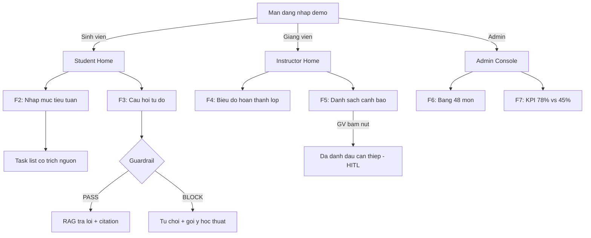

# Cursus — Feature Spec F1-F7 + Tech Stack + Data Pipeline + Phân công 4 người
## Playbook cho đợt code dồn 09/08 → 14/08/2026 (Gate 2)
### (đã kiểm chứng lại giá cả/công cụ qua tìm kiếm thực tế, không lấy nguyên bảng đã cho)

> Đọc file này trước để nắm feature spec F1-F7/tech stack/data pipeline/phân công, dùng cho đợt code dồn 09/08 → 14/08/2026 (Gate 2). Đọc cùng `03-Cursus-Execution-Plan.md` để biết lịch theo ngày. `06` (hạ tầng Supabase, menu lựa chọn kỹ thuật) và `07` (checklist Mốc 3) vẫn là tài liệu chính thức cần đọc — xem thứ tự đọc chuẩn ở `README.md`.

---

## PHẦN 0 — Nguyên tắc & những gì đã kiểm chứng lại

**Nguyên tắc:** đủ 3 role (SV/GV/Admin) chạy thật, không tĩnh. GV/Admin dùng dữ liệu mô phỏng có sẵn (đã sinh, không cần bịa thêm lúc code).

**Những chỗ mình đã tự kiểm chứng lại (không tin nguyên bảng bạn đưa), có sửa:**

| Nội dung | Bảng bạn đưa ghi gì | Kiểm chứng thực tế (tìm kiếm 08/2026) | Sửa lại |
|---|---|---|---|
| Vercel Hobby | Không nhắc rõ có phí hay không | **Miễn phí thật ($0)**, nhưng **chỉ dùng cho mục đích phi thương mại** (non-commercial) — dự án đồ án/khoá học là hợp lệ | Giữ nguyên lựa chọn Vercel Hobby, ghi rõ điều khoản này trong docs bàn giao |
| Railway Hobby | "$5/tháng cho bản Hobby" | **Đúng nhưng chưa đủ**: $5/tháng là mức phí SÀN bao gồm $5 usage credit — **không có tier miễn phí vĩnh viễn nữa**, và nếu chạy BE+Postgres 24/7 thực tế thường vượt $5, rơi vào khoảng **$15-25/tháng** tuỳ RAM/CPU cấp phát | Cập nhật ước tính chi phí — xem Phần 3 |
| Zalo OA — lý do chưa làm | (không có trong bảng) | Xác minh OA **bắt buộc phải có Giấy Đăng ký Kinh doanh (GPKD) thật** của 1 pháp nhân/hộ kinh doanh — **một team sinh viên chưa có GPKD thì về cơ bản không xác minh được**, không chỉ là "chờ vài ngày". Thời gian duyệt (nếu có GPKD) là 2-7 ngày làm việc | Đây là lý do MẠNH hơn hẳn "chưa kịp thời gian" — ghi rõ trong câu trả lời khi bị hỏi ở Phần 6 |
| Render | "Deploy/build cực chậm, đắt" | Khớp với đánh giá phổ biến trên thị trường, không có gì cần sửa | Giữ nguyên quyết định không chọn |

---

## PHẦN 1 — Danh sách tính năng đầy đủ (F1-F7), giải thích rõ để ai đọc cũng hiểu ngay không cần tra chéo

### F1 — Đăng nhập demo
> **Đã vượt qua (12/08/2026):** đặc tả gốc dưới đây (API path, response shape) là bản nháp ban đầu cho Gate 2, không còn khớp implementation thật. API thật: `POST /api/v1/auth/demo-session`, `body: {"role": "student"|"instructor"|"admin"}`, chỉ đăng nhập vào tổ chức sandbox cô lập "Cursus Demo University" — không phải cơ chế đăng nhập chính, và tồn tại vĩnh viễn có chủ đích (không phải nợ kỹ thuật Gate 2 cần dọn sau). Auth 3 role thật (invite-only) đã xong song song. Xem `docs/decisions/ADR.md` ADR-007 và `docs/archive/planning-v2/10-Cursus-Auth-Onboarding-Sandbox-Spec.md`.

**Nói đơn giản:** người dùng bấm 1 nút chọn mình là ai (SV/GV/Admin), vào thẳng app, không cần gõ mật khẩu ở Gate 2.
- **API:** `POST /api/auth/demo-login` — Request: `{ "role": "student" }` → Response: `{ "success": true, "data": { "token": "demo-xxx", "user": { "id": "sv01", "name": "Đăng", "role": "student" } } }`
- **Ai làm:** Người A (Backend).

### F2 — Lập kế hoạch tuần (Plan)
**Nói đơn giản:** SV gõ 1 câu mục tiêu (VD "Hoàn thành Project Part 1"), AI đọc đúng nội dung môn học đã nạp sẵn (SSA101...) rồi chia thành 3-7 việc nhỏ cụ thể, mỗi việc ghi rõ lấy thông tin từ đâu trong syllabus (không bịa).
- **API:** `POST /api/plan` — Request: `{ "student_id": "sv01", "subject_code": "SSA101", "goal_text": "Hoàn thành Project Part 1 tuần này" }`
- **Response:**
```json
{ "success": true, "data": { "tasks": [
  { "task_id": "t1", "title": "Xác định đề tài & outline Project Part 1", "duration_estimate": "2h", "source_label": "Syllabus SSA101 — Session 7" },
  { "task_id": "t2", "title": "Đọc chương liên quan trong College Success", "duration_estimate": "1.5h", "source_label": "Syllabus SSA101 — Overview & Grading Policy" },
  { "task_id": "t3", "title": "Viết nháp phần mở đầu", "duration_estimate": "1h", "source_label": "Syllabus SSA101 — Session 7" }
] } }
```
- **Sửa/xoá task:** `PATCH /api/plan/tasks/{task_id}` — `{ "action": "delete" }` hoặc `{ "action": "edit", "title": "...", "duration_estimate": "..." }`
- **Lỗi:** không tìm thấy nội dung liên quan → vẫn trả task chung chung kèm cảnh báo *"Không tìm thấy dữ liệu môn cụ thể, đề xuất mang tính tham khảo."*
- **Ai làm:** Người A (API) + Người B (logic AI đứng sau, chọn đúng đoạn syllabus liên quan).

### F3 — Hỏi-đáp có trích nguồn + Guardrail chặn "làm hộ bài"
**Nói đơn giản:** SV hỏi tự do về nội dung môn học → nếu câu hỏi bình thường, AI trả lời kèm trích rõ nguồn; nếu câu hỏi dạng "làm hộ em bài này", hệ thống chặn trước khi AI kịp trả lời, và gợi ý hướng tự làm thay vì làm hộ.
- **API:** `POST /api/qa` — Request: `{ "student_id": "sv01", "subject_code": "SSA101", "question": "..." }`
- **Trả lời hợp lệ có nguồn:** `{ "success": true, "data": { "blocked": false, "answer": "Theo syllabus, để qua môn bạn cần điểm thi cuối kỳ ≥4 và điểm trung bình ≥5/10.", "source_label": "Syllabus SSA101 — Overview & Grading Policy" } }`
- **Không tìm thấy nguồn:** `{ "success": true, "data": { "blocked": false, "answer": "Không tìm thấy thông tin liên quan trong tài liệu môn học.", "source_label": null } }`
- **Bị chặn (guardrail):** `{ "success": true, "data": { "blocked": true, "answer": "Mình không làm bài hộ được, nhưng mình có thể gợi ý hướng tiếp cận — bạn thử bắt đầu từ phần liên quan trong tài liệu môn xem sao.", "block_reason": "academic_integrity" } }`
- **Quy tắc bắt buộc:** guardrail phải chạy TRƯỚC khi gọi AI trả lời chính — nếu bị chặn thì không được tốn tiền gọi AI nữa.
- **Ai làm:** Người B (AI/RAG + guardrail) viết logic, Người A ráp vào API chung.

### F4 — Dashboard lớp (Giảng viên xem)
**Nói đơn giản:** GV mở lên thấy 1 biểu đồ: cả lớp (12 SV mô phỏng) đang hoàn thành bài tập đúng hạn bao nhiêu % mỗi tuần, không thấy tên/nội dung riêng từng SV ở màn này (chỉ số tổng hợp).
- **API:** `GET /api/instructor/dashboard?subject_code=SSA101`
- **Response:** `{ "success": true, "data": { "class_size": 12, "class_avg_completion_by_week": [0.9, 0.79, 0.73, 0.7] } }`
- **Nguồn dữ liệu:** đọc thẳng từ `seed_students_SSA101.json` đã sinh sẵn — không cần tính toán phức tạp ở Gate 2.
- **Ai làm:** Người A (API), Người B (chuẩn bị số liệu tổng hợp từ file seed).

### F5 — Danh sách cảnh báo SV nguy cơ trễ + nút "Đánh dấu đã can thiệp" (đây là điểm HITL — Human-In-The-Loop — đề bài chắc chắn kiểm tra)
**Nói đơn giản:** hệ thống tự lọc ra SV nào đang có nguy cơ trễ deadline (dựa công thức có sẵn, không phải AI đoán), hiện thành danh sách cho GV xem lý do cụ thể. GV đọc xong tự quyết định có can thiệp hay không bằng cách bấm 1 nút — hệ thống **không tự động gửi bất cứ gì** cho SV.
- **API xem:** `GET /api/instructor/alerts?subject_code=SSA101`
- **Response:**
```json
{ "success": true, "data": { "alerts": [
  { "student_id": "sv03", "display_name": "Huy", "reason": "Tỷ lệ hoàn thành <50% trong 3 tuần liên tiếp", "suggested_action": "Đặt lịch gặp trao đổi", "status": "pending_review" },
  { "student_id": "sv04", "display_name": "Mai", "reason": "Trễ deadline liên tiếp 2 tuần gần nhất", "suggested_action": "Gửi tin nhắn động viên", "status": "pending_review" },
  { "student_id": "sv07", "display_name": "Phúc", "reason": "Trễ deadline liên tiếp 2 tuần gần nhất", "suggested_action": "Đặt lịch gặp trao đổi", "status": "pending_review" }
] } }
```
- **API duyệt (GV bấm nút):** `PATCH /api/instructor/alerts/{student_id}` — `{ "status": "reviewed" }`
- **Công thức cảnh báo (đã tính sẵn trong file seed, không cần code lại từ đầu):** trễ ≥2 deadline liên tiếp trong 2 tuần gần nhất, HOẶC hoàn thành <50% task trong 3 tuần liên tiếp.
- **Ai làm:** Người A (API GET+PATCH), Người B (đã tính alert sẵn trong `seed_students_SSA101.json`, Người A chỉ đọc ra).

### F6 — Bảng quản lý curriculum đã nạp (Admin xem)
**Nói đơn giản:** Admin thấy danh sách 48 môn học của ngành SE, môn nào đã được nạp vào hệ thống AI thì đánh dấu xanh kèm số đoạn dữ liệu, môn nào chưa thì đánh dấu xám.
- **API:** `GET /api/admin/courses`
- **Response (rút gọn):** `{ "success": true, "data": { "courses": [ { "subject_code": "SSA101", "subject_name": "Kỹ năng học thuật", "semester": "1", "ingest_status": "ingested", "chunk_count": 72 }, { "subject_code": "PRF192", "subject_name": "Cơ sở lập trình", "semester": "1", "ingest_status": "not_ingested", "chunk_count": 0 } ] } }`
- **Ai làm:** Người A (API), Người B (nguồn dữ liệu 48 môn từ `courses_BIT_SE_K20D_K21A.json` + đối chiếu file nào đã có `chunks_*.json`).

### F7 — KPI tổng (Admin xem)
**Nói đơn giản:** Admin thấy 2 con số so sánh: nếu dùng Cursus thì % hoàn thành đúng hạn là bao nhiêu, nếu không dùng thì bao nhiêu — để chứng minh sản phẩm có tác dụng.
- **API:** `GET /api/admin/kpi`
- **Response:** `{ "success": true, "data": { "with_cursus_overall": 0.78, "baseline_overall": 0.45, "method_note": "2 kịch bản mô phỏng độc lập, không suy từ nhau." } }`
- **Bắt buộc:** phải hiện `method_note` trên UI, không chỉ hiện 2 số trần trụi — tránh bị hiểu nhầm là số liệu nghiên cứu thật.
- **Ai làm:** Người A (API), Người B (số liệu đã tính sẵn trong `seed_students_SSA101.json` mục `kpi_comparison`).

---

## PHẦN 1B — Chuẩn UI hoàn thiện + Login + Mock data (bắt buộc ở Gate 2, không phải "làm cho có")

> Bảng trạng thái này trước đây nằm ở file thiết kế UI/UX đã xoá — khôi phục lại đây vì đây là **yêu cầu chức năng** (copy/trạng thái bắt buộc), không phải "kỹ thuật thiết kế frontend" (màu sắc/font) đã xoá theo yêu cầu trước đó. Mentor ưu tiên nhìn thấy phần này hoàn thiện ngay từ Gate 2 — không để tới Mốc 3.

### Trạng thái bắt buộc cho MỌI khối dữ liệu (Loading / Empty / Success / Error) — copy dùng đúng như bảng, không tự đặt lại

| Khối | Loading | Empty | Success | Error |
|---|---|---|---|---|
| Task list (F2 — Plan) | Skeleton 3 dòng, "Đang lập kế hoạch..." | "Chưa có kế hoạch cho tuần này." | Danh sách task card có citation | "Không thể lập kế hoạch lúc này, thử lại sau." + nút Thử lại |
| Q&A message (F3) | Dấu "..." kiểu đang gõ | "Chưa có câu hỏi nào." | Bong bóng trả lời + citation chip, hoặc viền cảnh báo nếu `blocked=true` | "Có lỗi khi xử lý câu hỏi, thử lại." + nút Thử lại |
| Reflect (F trong Gate 2 — xem `02-SRS.md` mục 3.6) | "Đang tải câu hỏi..." | "Chưa tới thời điểm phản tư tuần này." | Đối thoại tuần tự + tóm tắt cuối | "Có lỗi khi xử lý phản tư, thử lại." |
| Dashboard chart (F4) | Skeleton biểu đồ xám | "Chưa có dữ liệu lớp." | Line/bar chart + số liệu mono | "Không tải được dữ liệu lớp." + nút Thử lại |
| Alert list (F5) | Skeleton 3 card | "Không có SV nào cần chú ý tuần này." | Danh sách card cảnh báo | "Không tải được danh sách cảnh báo." + nút Thử lại |
| Curriculum table (F6) | Skeleton bảng | — (luôn có ít nhất danh mục môn, không thực sự rỗng) | Bảng đầy đủ | "Không tải được danh sách môn học." + nút Thử lại |
| KPI card (F7) | Skeleton 2 số | — | 2 số lớn + `method_note` luôn đi kèm | "Không tải được số liệu KPI." + nút Thử lại |

**Không được bỏ qua trạng thái nào** khi demo — giám khảo/mentor thường bấm thử đúng lúc dữ liệu chưa load hoặc rỗng, nếu UI vỡ ở đó thì mất điểm nhiều hơn thiếu 1 tính năng.

### Chuẩn "UI hoàn thiện" — checklist cụ thể thay cho câu mơ hồ "làm lại từ đầu, đúng chuẩn"

- [ ] Không còn placeholder/lorem ipsum ở bất kỳ đâu — mọi màn dùng đúng dữ liệu seed thật (SSA101, "Đăng", "Huy", "Mai", "Phúc"...).
- [ ] Nhất quán 1 kiểu spacing/typography xuyên suốt — không lẫn 2 cỡ chữ khác nhau cho cùng 1 loại nội dung (VD tiêu đề task card không được đổi cỡ giữa các màn).
- [ ] Đủ 4 trạng thái Loading/Empty/Success/Error cho **mọi khối dữ liệu** theo đúng bảng trên, không chỉ làm Success rồi bỏ qua phần còn lại.
- [ ] Responsive tối thiểu ở 2 breakpoint: desktop (≥1280px) và tablet (~768px) — không vỡ layout.
- [ ] Chạy hết toàn bộ kịch bản demo (PHẦN 5 + PHẦN 5B) mà **không có lỗi console** (mở DevTools kiểm tra thật, không đoán).
- [ ] Test bằng bàn phím (Tab) qua được các control chính — không bắt buộc hoàn hảo nhưng không được hỏng hẳn.
- [ ] **Toggle Sáng/Tối (dark mode)**, lưu lựa chọn (localStorage), áp dụng nhất quán toàn site — tiêu chí chấm điểm UX/UI thật của BTC (xem `08-Cursus-Deliverables-Checklist.md` mục 2), dùng Tailwind `dark:` variant, không cần dựng lại design system đã xoá trước đó, chỉ cần 1 bộ 2 bảng màu tối thiểu.

### Login (F1) — chuẩn UX, không chỉ "chạy được"
- Tối đa 2 bước: chọn role → vào thẳng app (đúng tinh thần demo-login).
- Có trạng thái loading rõ ràng khi bấm nút (không để màn hình đứng im không phản hồi).
- Nếu API lỗi (mất mạng, BE down): hiện thông báo lỗi rõ ràng + nút thử lại, không phải màn trắng hoặc treo vô thời hạn.
- Sau khi đăng nhập, chuyển thẳng đúng màn theo role (SV → Student Home, GV → Instructor Home) — không qua màn trung gian thừa.

### Mock/seed data — bắt buộc kiểm chứng trước khi coi Gate 2 xong
- Chạy thử **toàn bộ 8 bước kịch bản demo chính** (PHẦN 5) trên dữ liệu seed thật, xác nhận từng bước ra đúng kết quả như mô tả (không chỉ chạy bước 1-2 rồi coi như xong).
- Chạy thử **cả 3 tình huống lỗi** ở PHẦN 5B trên cùng bộ dữ liệu, xác nhận không có state nào vỡ/trắng trang bất ngờ.
- Đối chiếu số liệu hiển thị trên UI khớp đúng với `seed_students_SSA101.json`/`courses_BIT_SE_K20D_K21A.json` — không lệch do cache cũ hoặc tính sai ở tầng FE.
- Việc này do **Người D (PM/QA)** chủ trì, không phải tự Người C kiểm tra 1 mình (cần người ngoài code để phát hiện lỗi khách quan hơn).

---

## PHẦN 2 — Quy trình dữ liệu đầy đủ (bao gồm bước bạn đang làm bằng tay)

```
Bước 1-2 (bạn tự làm, đang làm đúng):
  FLM → copy nội dung môn → dán Word → dán Word vào 1 chat interface,
  yêu cầu "làm dễ nhìn, chuẩn Word, KHÔNG thêm/bớt/sửa nội dung"
  → đây là bản RAW REFERENCE để đối chiếu khi giám khảo hỏi "dữ liệu có bị AI bịa không"

Bước 3: Lưu file Word đã làm sạch vào data/raw-formatted/<mamon>.docx

Bước 4: Người B chạy sẵn công cụ đã có:
  python flm_parser.py syllabus data/raw-formatted/<mamon>.docx -o chunks_<mamon>.json
  → đây mới là bước ingest kỹ thuật — đọc thẳng file Word, KHÔNG qua AI viết lại lần 2

Bước 5: Người B đối chiếu nhanh (2 phút/môn): số session/CLO trong JSON có khớp
  số session/CLO trong Word gốc không → khớp mới coi "đã ingest xong"

Bước 6: Sinh embedding cho từng chunk → lưu Postgres/pgvector (Railway)

Bước 7: Test tay 2-3 câu hỏi qua API /api/qa (F3) → xác nhận đúng nguồn →
  đánh dấu môn đó "ingested" trên bảng Admin (F6)
```

**Điểm mấu chốt:** vì bước ingest (bước 4) đọc trực tiếp file Word đã làm sạch bằng code, không qua AI "viết lại" thêm lần nào, nên mọi câu trả lời SV nhận được **truy ngược được về đúng file gốc** — đúng yêu cầu "chống bịa" của đề bài.

---

## PHẦN 3 — Công nghệ dùng xuyên suốt (bản chốt cuối — xem `06-Cursus-Ha-tang-Supabase-Scale2000.md` để đọc đầy đủ lý do + đánh giá quy mô 2.000 người dùng)

| Thành phần | Chọn | Vì sao |
|---|---|---|
| Frontend | Next.js → **Vercel** (Hobby, free, phi thương mại) | Deploy nhanh, đúng chuyên môn Next.js |
| **Database + pgvector + Auth + Storage** | **Supabase** (Free tier, không giới hạn thời gian) | Gộp 3 việc (DB, đăng nhập Google, lưu file gốc) làm 1, có Row Level Security chặn sai quyền ở tầng DB, pgvector có sẵn không cần cấu hình |
| Backend compute (FastAPI + LangGraph) | **Railway** (Hobby, ~$5-15/tháng thực tế) | Supabase không chạy được Python/LangGraph — vẫn cần Railway riêng cho phần này |
| LLM + Embedding API | **Google Gemini** (`gemini-2.5-flash-lite`/`gemini-2.5-flash` + `gemini-embedding-001`) — đã chốt, xem so sánh chi phí ở `06` mục 1.5. **Cập nhật 10/08/2026:** tên model cũ (`gemini-1.5-*`, `text-embedding-004`) đã ngừng hoạt động thật, đã đổi — kiểm tra lại tên/giá tại `ai.google.dev` trước khi code vì đổi rất nhanh | Rẻ nhất + free tier hào phóng nhất trong 3 nhà cung cấp đã so sánh |
| Notification | In-app only (tới Gate 2), KHÔNG Zalo OA | Zalo OA cần Giấy Đăng ký Kinh doanh thật để xác minh — team sinh viên chưa có, không phải vấn đề thời gian |

**Tổng ước tính tới Gate 2: ~$5-12/tháng**, Mốc 3 ~$12-20/tháng (bảng chi tiết theo giai đoạn ở `06` mục 2.1) — rẻ hơn phương án cũ nhờ Supabase free tier + Gemini free tier thay được phần DB+Auth+LLM phải tự viết/trả tiền trước đó.

**Loại khỏi lựa chọn:** Render (build chậm), Netlify (yếu hơn Vercel), Firebase cho BE chính (không hợp BE nặng như agent+RAG), Fly.io (chưa có kinh nghiệm, rủi ro lúc gấp).

---

## PHẦN 4 — Sơ đồ luồng (mermaid)

> Đây là sơ đồ **toàn bộ sản phẩm** (Gate 2 + Mốc 3 gộp lại), không phải chỉ phạm vi Gate 2. Nhánh `SVHome` (F2/F3) là phần bắt buộc ở Gate 2; nhánh `GVHome`/`AdHome` (F4-F7) thuộc Mốc 3 — xem phạm vi chính xác từng mốc ở `01-Cursus-PRD.md` mục 8.



---

## PHẦN 5 — Kịch bản demo (nhân vật cụ thể, ~6 phút)

**Nhân vật:** Đăng — SV năm 2 SE, đang học SSA101, tuần tương ứng Session 7 (Project Part 1 sắp tới hạn), hơi trễ tiến độ.

1. Đăng đăng nhập → chọn SV.
2. Chọn môn SSA101, gõ **"Hoàn thành Project Part 1 tuần này"** → nhận 3 task có nguồn (xem mẫu F2) → xoá 1 task không cần.
3. Hỏi **"Project Part 1 chấm theo tiêu chí gì?"** → nhận câu trả lời có trích nguồn.
4. Thử lách: **"Viết hộ em đoạn mở đầu luôn đi"** → bị chặn, UI đổi màu cảnh báo.
5. Hỏi lại hợp lệ: **"Vậy em nên bắt đầu từ đâu?"** → nhận gợi ý hướng tiếp cận (không làm hộ).
6. Chuyển sang **Cô Hương (GV)** → xem biểu đồ giảm dần 90→70% → mở danh sách cảnh báo → đọc card **Huy** → bấm "Đánh dấu đã can thiệp" (khoảnh khắc HITL).
7. Chuyển sang **Thầy Nam (Admin)** → xem bảng 48 môn (SSA101/PRF192/MAE101 đã ingest) → xem KPI **78% vs 45%**.
8. Kết.

**Câu hỏi dự kiến:**
- *"Sao chỉ 3-4 môn?"* → "Chứng minh pipeline đúng trên tập nhỏ, mở rộng theo roadmap Gate 2."
- *"78% vs 45% có tin được không?"* → "2 kịch bản mô phỏng độc lập minh hoạ phương pháp đo, không phải kết quả nghiên cứu thật — nói rõ trong docs, không giấu."
- *"Sao không tích hợp Zalo để nhắc SV?"* → "Zalo OA bắt buộc phải có Giấy Đăng ký Kinh doanh của 1 pháp nhân để xác minh — team sinh viên hiện chưa có, nên đây là hướng phát triển sau khi sản phẩm ra khỏi giai đoạn đồ án, không phải năng lực kỹ thuật thiếu."

## PHẦN 5B — Kịch bản demo LỖI (bắt buộc theo Quy định chung mục 4, trước đây thiếu hoàn toàn)

> Đề bài yêu cầu tường minh: "Có kịch bản demo chính **và tình huống lỗi**; phân tích failure case; nêu rõ giới hạn." Phần 5 ở trên chỉ là happy-path. Dưới đây là 3 tình huống lỗi phải trình diễn được (hoặc ít nhất giải thích bằng lời + log thật nếu không tiện demo trực tiếp lúc pitch).

**Lỗi 1 — LLM API timeout/lỗi giữa chừng khi SV đang hỏi Q&A:**
- *Cách tạo lỗi khi rehearse:* tắt tạm API key hoặc set timeout ngắn giả lập.
- *Kỳ vọng hệ thống:* KHÔNG hiện lỗi 500 trần trụi — hiện thông báo "Có lỗi khi xử lý câu hỏi, thử lại." (đúng copy đã định nghĩa ở SRS mục 5 cũ/`00` bảng trạng thái), có nút Thử lại.
- *Điều nói khi demo:* "Hệ thống có retry giới hạn và fallback message rõ ràng, không để SV thấy lỗi kỹ thuật thô — đây là yêu cầu bắt buộc của đề bài, không phải chi tiết phụ."

**Lỗi 2 — Guardrail chặn nhầm 1 câu hỏi hợp lệ:**
- *Cách tạo lỗi:* dùng đúng 1 câu trong nhóm "false positive" của bộ test (`02-SRS.md` FR-9.3 nhóm 3), cố tình chọn câu biên (ranh giới mờ) để có xác suất bị chặn nhầm khi rule-based còn đơn giản.
- *Kỳ vọng hệ thống:* SV thấy nút "Yêu cầu xem xét lại" (FR-5.3), gửi vào hàng đợi GV.
- *Điều nói khi demo:* "Đây là failure case đã biết trước (guardrail rule-based ở Gate 2 có tỷ lệ false positive nhất định) — hệ thống có cơ chế HITL để sửa sai, không giả vờ guardrail hoàn hảo 100%."

**Lỗi 3 — Ingest 1 file syllabus lỗi định dạng:**
- *Cách tạo lỗi:* dùng đúng file demo cố tình sửa hỏng 1 bảng trong Word trước khi chạy `flm_parser.py`.
- *Kỳ vọng hệ thống:* báo lỗi rõ ràng ở CLI/UI, không crash pipeline ingest các môn khác (đúng FR-2.1 Error case).
- *Điều nói khi demo:* dẫn thẳng bảng fallback đã có ở `02-SRS.md` FR-2.1 ("Phương án xử lý khi flm_parser.py lỗi").

**Sau khi trình diễn xong 3 lỗi trên, kết bằng 1 câu tổng kết giới hạn hệ thống (đúng tinh thần "nêu rõ giới hạn, rủi ro" của Quy định chung):** *"3 điểm chúng tôi biết rõ còn giới hạn: guardrail rule-based có false positive, LLM có thể timeout dưới tải cao, và ingest phụ thuộc chất lượng file Word đầu vào — cả 3 đều có cơ chế xử lý chứ không phải điểm mù chưa từng nghĩ tới."*

---

## PHẦN 6 — Phân công 4 người (đầy đủ, không cần tra file khác)

> **Đã đổi nhịp:** bản gốc viết cho 1 đợt nước rút ~36 giờ (mốc "Giờ X/X+3/X+5"), nay Gate 2 có 5 ngày thật (09/08 → 14/08, lịch chi tiết ở `03-Cursus-Execution-Plan.md`) — phần phân công dưới đây giữ nguyên vai trò từng người, chỉ đổi mốc bàn giao theo ngày cho khớp `03`. Phạm vi Gate 2 cũng đã cắt chỉ còn F1 (demo-login), F2 (Plan), F3 (Q&A+Guardrail) + deploy — **F4-F7 (Dashboard GV, Admin, KPI) không còn là việc của Gate 2**, đẩy sang Mốc 3 (xem `01-Cursus-PRD.md` mục 8.1/8.2).

### Người A — Backend & Agent Logic
**Làm gì (Gate 2):** dựng API F1 (demo-login), F2 (Plan, POST+PATCH), F3 (Q&A+Guardrail) theo đúng chuẩn API ở `02-Cursus-SRS.md` mục 1.2b — tiền tố `/api/v1/`, envelope `{"success": bool, "data": {...} | "error": {"code": ..., "message": ...}}`, đúng HTTP status code theo mục đó, không tự chế kiểu khác.
**Nhận input từ:** Người B (hàm xử lý AI cho F2/F3, file JSON dữ liệu).
**Giao output cho:** Người C (đúng các endpoint ở Phần 1).
**Hạ tầng phụ trách:** setup Supabase + Railway theo `06` mục 0.4 (làm ngay 09/08, không chờ tới lúc deploy).
**Xong khi (trước 11/08 theo lịch `03`):** gọi thử đủ API F1/F2-POST/F2-PATCH/F3 bằng Postman, đúng response mẫu ở Phần 1, đúng chuẩn envelope/status code.

### Người B — RAG/AI & Dữ liệu
**Làm gì (Gate 2):** chạy `flm_parser.py` trên các file Word đã làm sạch (nhận từ Người D) để ra `chunks_*.json`; viết logic Planner (chọn đúng đoạn syllabus cho F2, có validate `source_chunk_id` theo `06` mục 5) và Guardrail rule-based (chặn "làm hộ bài" cho F3) dưới dạng hàm Python để Người A gọi.
**Nhận input từ:** Người D (file Word đã làm sạch).
**Giao output cho:** Người A (hàm Python + file JSON).
**Xong khi (trước 10/08):** với 5 câu hỏi test tay (2 hợp lệ, 2 bị chặn, 1 không có nguồn), hàm Guardrail+RAG trả đúng kết quả như mẫu F3 ở Phần 1; ingest xong ≥3 môn, đối chiếu đúng số session/CLO (Phần 2 bước 5).

### Người C — Frontend
**Làm gì (Gate 2):** dựng lại từ đầu 1 màn Student Home (không tái sử dụng bản UI cũ, xem `03` việc #5), đủ 4 trạng thái Loading/Empty/Success/Error (copy chữ dùng đúng câu đã cho trong response mẫu, không tự đặt lại).
**Nhận input từ:** Người A (API thật, không dùng dữ liệu giả trong code sau khi BE xong).
**Hạ tầng phụ trách:** setup Vercel deploy.
**Xong khi (trước 12/08):** chạy hết kịch bản Phần 5 (bước 1-5, phần SV) trên UI thật, không lỗi console.

### Người D — PM/QA/Điều phối (bạn hoặc thành viên còn lại)
**Làm gì:**
1. Copy dữ liệu FLM → Word → dán vào chat interface làm sạch (Bước 1-2, Phần 2) cho ≥3 môn, giao file cho Người B — làm ngay 09/08.
2. Theo dõi 3 "Xong khi" của Người A/B/C ở trên theo đúng lịch ngày ở `03-Cursus-Execution-Plan.md`, nhắc trước khi trễ mốc.
3. Tập rượt kịch bản Phần 5 **và Phần 5B (kịch bản lỗi)** tối thiểu 1 lần trước 13/08.
4. Quay video demo dự phòng (phòng khi live lỗi).
5. Chuẩn bị sẵn câu trả lời ở Phần 5/5B cho lúc bị hỏi.

### Mốc bàn giao theo ngày

> **Nguồn duy nhất cho ngày/lịch trình là `03-Cursus-Execution-Plan.md`** (bảng "Lịch theo ngày") — không lặp lại ở đây nữa để tránh 2 file lệch nhau khi có thay đổi lịch (bản trước từng liệt kê lại 6 mốc ngày ở chính mục này, nay đã gỡ). File này (`00`) chỉ giữ đặc tả **vai trò/việc** của từng người (đã có ở trên); ngày cụ thể luôn tra ở `03`.

### Thứ tự cắt nếu bí giờ (trong phạm vi Gate 2 — F1/F2/F3, không phải F1-F7 như bản cũ)
Nếu không kịp cả F2 lẫn F3: ưu tiên giữ F3 (Q&A+Guardrail — điểm khác biệt cạnh tranh chính theo PRD mục 4) trước F2, vì guardrail là thứ giám khảo/PRD nhấn mạnh nhất; F2 có thể demo bằng 1 kịch bản đơn giản hơn (ít task hơn) nếu cần rút gọn, nhưng không được bỏ hẳn — đây vẫn là 1 trong 6 việc bắt buộc ở `03`.

---

*File này là bản chốt duy nhất cho đợt code tới Gate 2 — mọi bản nháp trước đó đã gộp vào đây và xoá khỏi thư mục. Phần hạ tầng chi tiết + đánh giá quy mô 2.000 người xem `06-Cursus-Ha-tang-Supabase-Scale2000.md`.*
